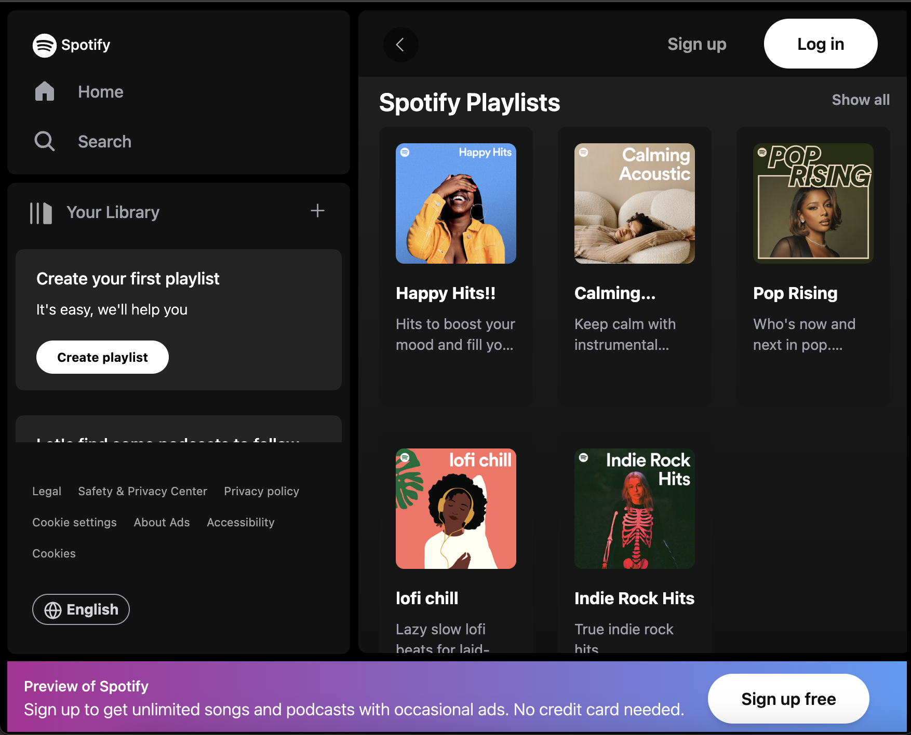

#  "Spotify" landing page

   
   
  

## Welcome!

This is responsive (up to 320px) "Spotify" landing page, created using React, Tailwind, Css.

🔹 Preview - <a href="https://simonakom.github.io/spotify-app/build/index.html">here</a>
 

## Getting Started

Follow these instructions to get a copy of the project up and running on your local machine for development and testing purposes.

### Prerequisites

Before you begin, ensure you have the following installed on your machine:

- Node.js: [Download here](https://nodejs.org/)
- npm (Node Package Manager): Comes with Node.js installation

### Installation

1. Clone this repository to your local machine
2. Navigate to the project directory
3. Install dependencies: `npm install`
4. Install React Icons: `npm install react-icons`
5. Once the dependencies are installed, you can start the development server and run the app:  `npm start`

### Viewing the App

The app will be available at your default web browser at http://localhost:3000.

### License
This project is licensed under the MIT License - see the LICENSE file for details. Intention is that you can use everything in this project as a starting point or as a bits and pieces in your own project.

Hope you find this project interesting and useful!

### Desktop version:

  

### Mobile version:
  

